# Third Milestone Project - Dishes

# Table Of Contents

1. UX
2. Features
3. Technologies Used
4. Testing
5. Deployment
6. Credits and Acknowledgements

There are two goals for this website. The first is for external users to find and share recipes, the second is for the owners of the site to promote theire brean of cooking utensils.

# UX

#### User Stories
- As an external user coming to the site I want the following:
    - When I land on the homepage I want to see the experiences that others have had.
    - I want to be able to easily sign into my account, or if I dont have an account I want ease in registering.
    - I want to be able to easily Navigate throughout the website.
    - I want to be able to search for recipes that I am interested in.
    - I want to be able to add in my own recipes.

- As the owner of this webiste I want the following:
    - I want a positve first impression for when incoming users land on the site.
    - I want incoming users to be able to easily sign up or log in.
    - I want my brand of cooking utensils/tools to be promoted to incoming users.

#### Wireframes:
The five planes of UX were kept in mind from the beginning of the design to the end. However I deviated from the wireframes as I built out the wesite. In the beginning in making the wireframes I originally planned on having four screens. But as I continued to builed out the website it became obvious that I would also need to include a profile page, a login and register page.

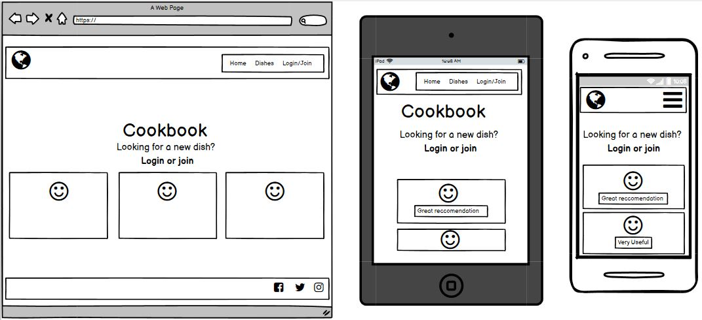

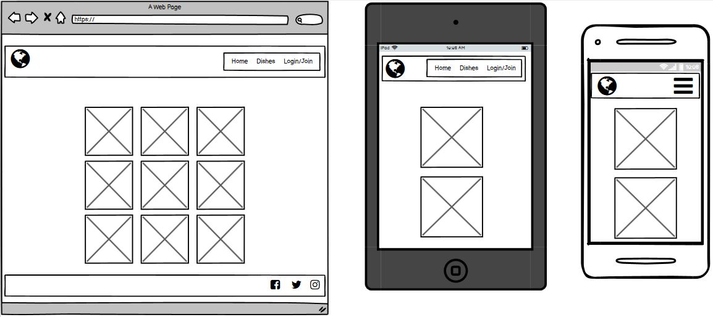

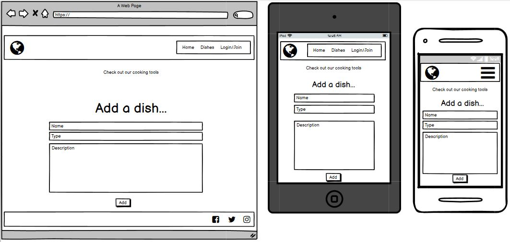

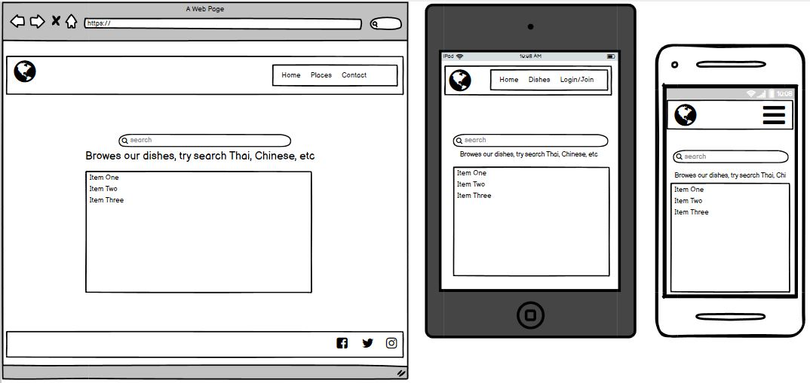

#### Design
#### Styling 
#### Images

## Features
- Navbar at the top of each page which collapses into a side-nav provides easy navigation around the site.
- The homepage has a carousel that auto rotates through the cooking utensils to promote the owners brand.
- The profile page allows users to update or delete any previous recipies they have added.
- The "Add Your Dish" page allows users to create and add their own dishes to the website.
- The "Add Your Dish" page allows users to search all the recipies that have been added to the site.
- The "Join" page allows users to create their own registration details which are then stored on MongoDB and accessed once the user logs in.

# Technologies Used

- HTML5 for the website strcuture.

- CSS3 for the websites appearence.

- JQuery

- Python3 

- MongoDB

# Testing

## Homepage
<<<<<<< HEAD

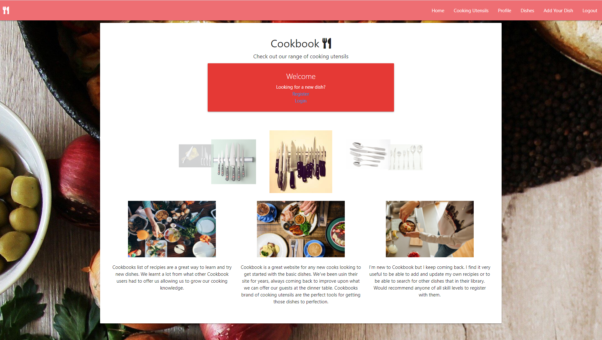

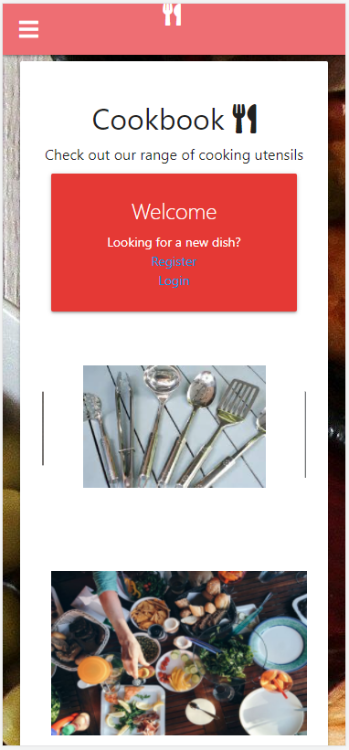

## Cooking Utensils
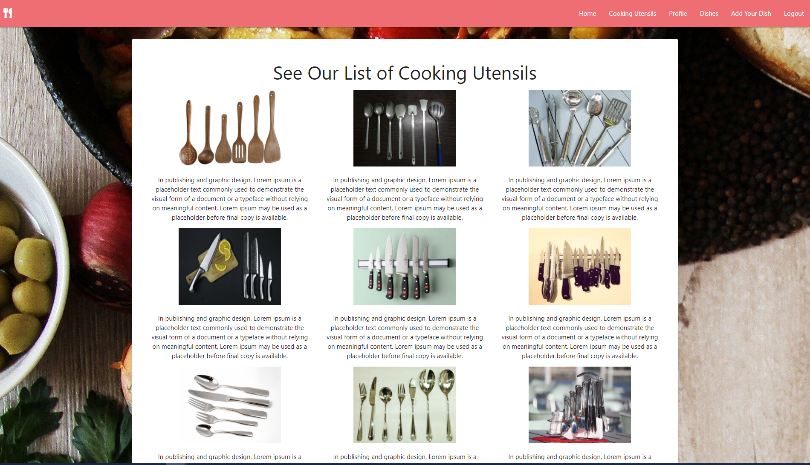

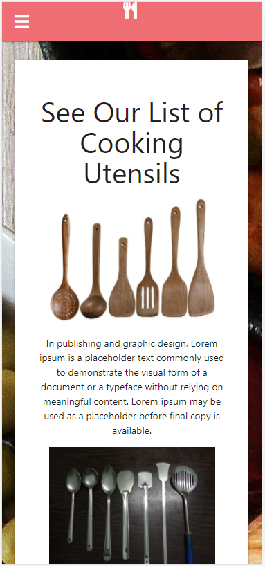

## Profile
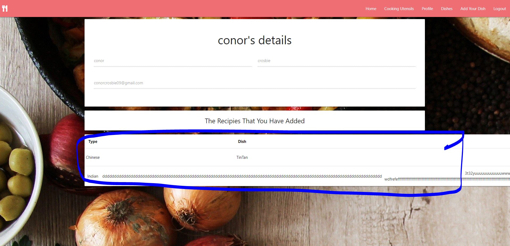

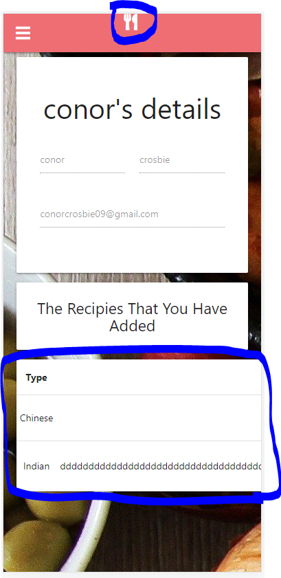

## Dishes
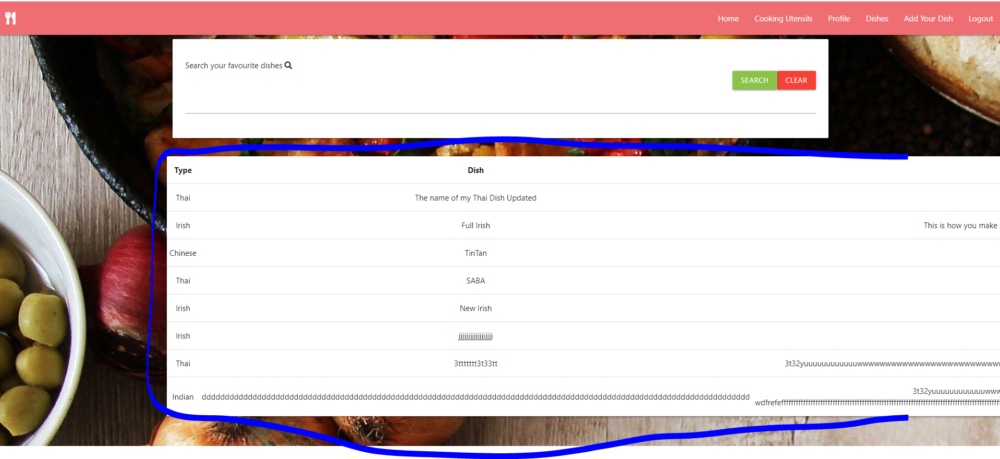

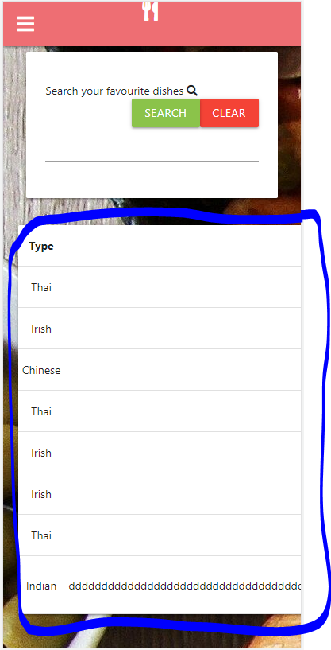

## Add Your Dish
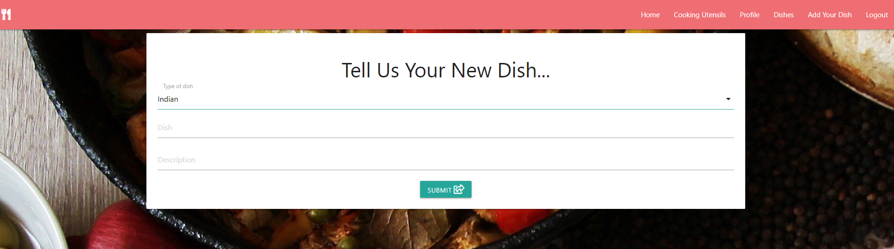

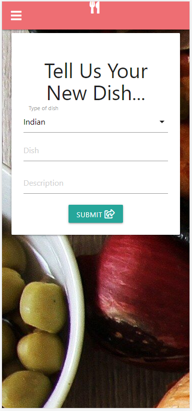
=======
#### Desktop
Homepage works as intended on the desktop. The User lands on the page and everything displays correctly and the carousel of utensils rotates around as expected.

#### Mobile
Homepage works as intended on the mobile. he User lands on the page and everything displays correctly and the carousel of utensils rotates around as expected.

## Cooking Utensils
#### Desktop
Displays as intended

#### Mobile
Displays as intended except for the LOGO at the top, needs to be centered on the Navbar.

## Profile
#### Desktop
Table needs to be corrected, its currently extending out to the left. Can be fixed with a multiline text input field.

#### Mobile
LOGO at the top needs to be centered on the Navbar. 
Table needs to be corrected, its currently extending out to the left. Can be fixed with a multiline text input field.

## Dishes
#### Desktop
As on the Profile page the table on the Dishes page needs to be corrected.

#### Mobile
LOGO at the top needs to be centered on the Navbar. 
As on the Profile page the table on the Dishes page needs to be corrected.

Table needs to be corrected
## Add Your Dish
#### Desktop

>>>>>>> 31dae3464720c2b301a2a7c22a28e5de5b26efa4

- https://pixnio.com/media/woman-cooking-breakfast-people-ingredients
- https://www.pxfuel.com/en/free-photo-eleiv
- https://www.wallpaperflare.com/cooked-dish-on-white-plate-flat-lay-photography-of-cooked-food-with-coffees-wallpaper-zuewu

- https://www.flickr.com/photos/30478819@N08/49576980893
- https://www.pinterest.ie/pin/490610953162756931/
- https://commons.wikimedia.org/wiki/File:Bengali_cooking_tools.JPG
- http://www.freeimageslive.co.uk/taxonomy/term/14/links.htm?page=4
- https://www.pxfuel.com/en/free-photo-eufmw
- https://www.indiamart.com/proddetail/kitchen-knife-set-17250618055.html
- https://pxhere.com/en/photo/894960
- https://www.pxfuel.com/en/free-photo-erzod
- https://www.piqsels.com/en/public-domain-photo-ftvfv

