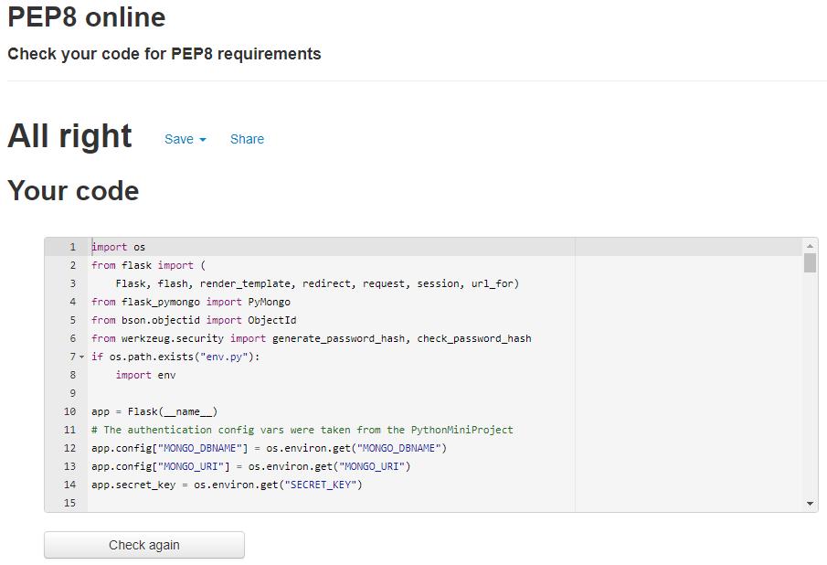

# Third Milestone Project - Dishes

# Table Of Contents

1. UX
2. Features
3. Technologies Used
4. Testing
5. Deployment
6. Credits and Acknowledgements

There are two goals for this website. The first is for external users to find and share recipes, the second is for the owners of the site to promote their brand of cooking utensils.

# UX

#### User Stories
- As an external user coming to the site I want the following:
    - When I land on the homepage I want to see the experiences that others have had.
    - I want to be able to easily sign into my account, or if I dont have an account I want ease in registering.
    - I want to be able to easily navigate throughout the website.
    - I want to be able to search for recipes that I am interested in.
    - I want to be able to add in my own recipes.

- As the owner of this webiste I want the following:
    - I want a positve first impression for when incoming users land on the site.
    - I want incoming users to be able to easily sign up or log in.
    - I want my brand of cooking utensils/tools to be promoted to incoming users.

#### Wireframes:
The five planes of UX were kept in mind from the beginning of the design to the end. However I deviated from the wireframes as I built out the wesite. In the beginning in making the wireframes I originally planned on having four screens. But as I continued to builed out the website it became obvious that I would also need to include a profile page, a login and register page.

#### Design
The overall design for this website is simple but effective for the websites goals. The homepage instantly highlights a weclome message to a new user to join or for existing users to log in. Underneath that there is a carousel which slowly rotates through the brand of cooking utensils, upon clicking on an image the user is redirected to the utensils page which has greater information.

If the user wants to access the library of dishes, they either need to log in or register. Once they do this they will get access to their profile, the sites recipies from other users and they will be able to add/update/delete their own recipes and dishes on the website.

Throughout the website each form/table or center piece for that page is highlighted by a card panal which focuses the users attention. This provides for a good contrast between the background image and for a better user experience.

#### Styling 

The default font from materialize was kept as it seemed to provide a very easy to read style. -apple-system,BlinkMacSystemFont

#### Images

The background image was selected as it gave a perfect first impression for when a user first lands. It is instantly clear at first glance that this is a cooking related website.

The 3 previous user review images were also selected to give a great first impression, they show the wholesome dishes that have been created in the past from other users. 

The other images are the utensils. These were all selected to give a very clean and professional look. Thus promoting the brand Cookbook for the websites owners.

## Features
- Navbar at the top of each page which collapses into a side-nav provides easy navigation around the site.
- The homepage has a carousel that auto rotates through the cooking utensils to promote the owners brand.

    

- The profile page allows users to update or delete any previous recipies they have added.

    

- The "Add Your Dish" page allows users to create and add their own dishes to the website.

    

- The "Dishes" page allows users to search all the recipies that have been added to the site.

    

- The "Join" page allows users to create their own registration details which are then stored on MongoDB and accessed once the user logs in.

    

    

- A custom 404 page will give a friendly display to the user if they look for a page that isnt on the site.
    
    

# Technologies Used

- HTML5 for the website strcuture.

- CSS3 for the websites appearence.

- Materialize

- JQuery

- Python3 for the backend

- MongoDB as a databasee

- Flask as a web framework

- Heroku and Github for deployment

# Testing

## Homepage
#### Desktop
Homepage works as intended on the desktop. The User lands on the page and everything displays correctly and the carousel of utensils rotates around as expected.

#### Mobile
Homepage works as intended on the mobile. The User lands on the page and everything displays correctly and the carousel of utensils rotates around as expected.

## Cooking Utensils
#### Desktop
Displayed as intended when it had place holder text. However once I added in a proper description the formatted grid of the desktop was thrown off. I have fixed this for the moment by taking out the l4 class in the columns.

#### Mobile
Displays as intended except for the LOGO at the top, needs to be centered on the Navbar.
This has since been corrected with some CSS padding.

## Profile
#### Desktop
Table needs to be corrected, its currently extending out to the right. Can be fixed with a multiline text input field.

#### Mobile
LOGO at the top needs to be centered on the Navbar. This has since been corrected with some CSS padding.
Table needs to be corrected, its currently extending out to the left. Can be fixed with a multiline text input field.

## Dishes
#### Desktop
As on the Profile page the table on the Dishes page needs to be corrected. This has since been corrected by swapping out the input field with a textarea input and limiting it inside a container class.

#### Mobile
LOGO at the top needs to be centered on the Navbar. 
As on the Profile page the table on the Dishes page needs to be corrected.

Table needs to be corrected

## Add Your Dish

#### Desktop
The dishes page works as expected on the desktop. No need for any chages

#### Desktop
The dishes page works as expected on the mobile. No need for any chages

## Custom 404 page

#### Desktop
The custom 404 page works as intended for the desktop

#### Mobile
The custom 404 page works as intended for the mobile

#### Testing On Different Devices:
1. 24 inche dell monitor
2. 16 inche lenovo laptop
3. Galaxy S5
4. Pixel 2
5. iPhone 6/7 & 8
6. iPhone X 
7. iPad
8. Galaxy Fold

#### Testing with the HTML, CSS, Javascript and Python Validators

## Deployment

To deploy this project Heroku is needed for the backend and Github for the frontend. Accounts will be needed on both before starting.

 - Start with the developement enviroment, in my case Gitpod
 - In the developement enviroment install the requirements for this project found in requirements.txt using the pip3 command.
 - Setup the database MongoDB. From there set up the collections which will be used to store users,dish types and dishes added by users
 - Setup connection security, choose a connection method and then connect by following the instructs MongoDB provides once you click "connect" on the collection.
 - Once this is done enviroment variables will be needed. Store the enviroment variables in a file called "env.py" and then place that file in a ".gitignore" file.
 - Once this is done the python file called "app.py" can be created and run by typing "python3 app.py" into the terminal.
 - Deploy the app and Github
 - Then move over to Heroku and follow the instructions to get started.
 - Connect the app on Heroku to Github by entering the repository name and click connect.
 - Once this is done the enviroment variables that were entered into the "env.py" file will need to be entered into Heroku into the "Config Vars" in the settings tab. 
 - Finally ensure that automatic deployments is selected in the Deploy tab on Heroku so that changes flow through.

How to clone and deploy this project:
- Navigate to the repository where the project is stored.
- Click on the Code button which will give the option to download the content and the url.
- Copy the url.
- In your chosen IDE in the terminal type "git clone (followed by the copied url)".

Credits

- https://pixnio.com/media/woman-cooking-breakfast-people-ingredients
- https://www.pxfuel.com/en/free-photo-eleiv
- https://www.wallpaperflare.com/cooked-dish-on-white-plate-flat-lay-photography-of-cooked-food-with-coffees-wallpaper-zuewu

- https://www.flickr.com/photos/30478819@N08/49576980893
- https://www.pinterest.ie/pin/490610953162756931/
- https://commons.wikimedia.org/wiki/File:Bengali_cooking_tools.JPG
- http://www.freeimageslive.co.uk/taxonomy/term/14/links.htm?page=4
- https://www.pxfuel.com/en/free-photo-eufmw
- https://www.indiamart.com/proddetail/kitchen-knife-set-17250618055.html
- https://pxhere.com/en/photo/894960
- https://www.pxfuel.com/en/free-photo-erzod
- https://www.piqsels.com/en/public-domain-photo-ftvfv

Acknowledgements

https://www.youtube.com/watch?v=3O4ZmH5aolg